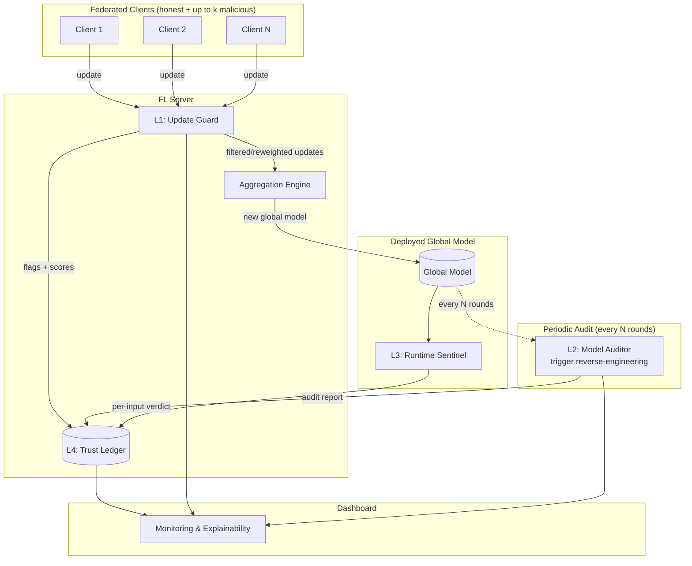
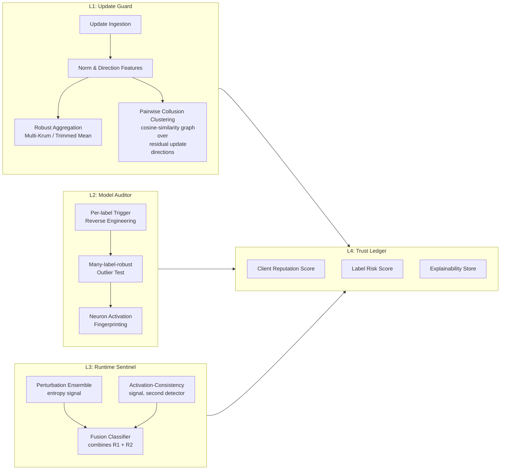
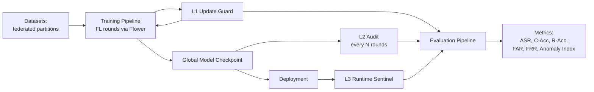
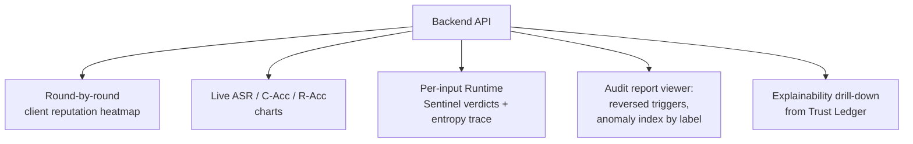
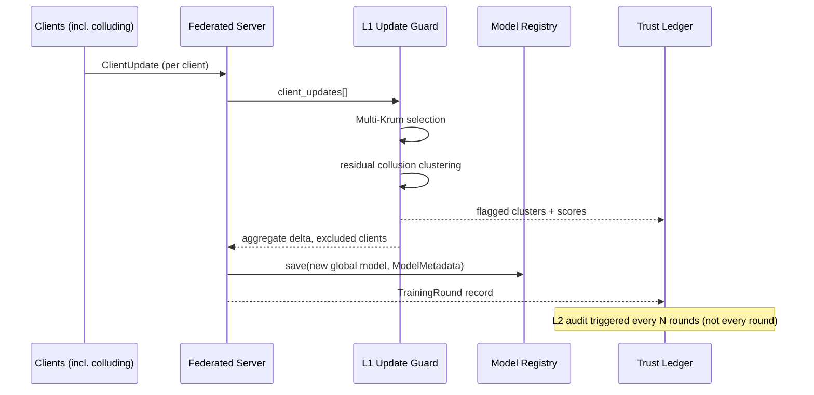
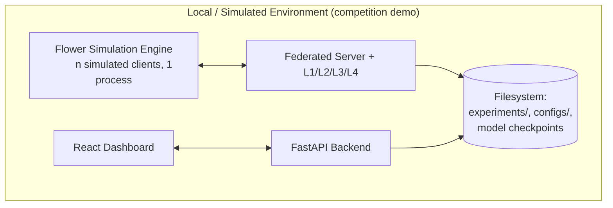
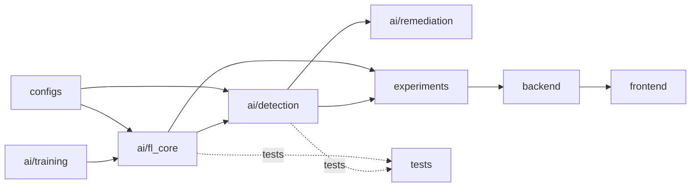

# ARCHITECTURE.md — SENTINEL-FL: Federated Backdoor Immune System

> Original design, inspired by but not derived from STRIP, Neural Cleanse, or
> BackdoorBench. See `RESEARCH.md` §3 for the gaps this design targets.

## 0. Design Thesis

Backdoors in distributed ML enter at the **client-update level**, persist in the
**global model**, and activate at the **inference level**. Every reference we reviewed
defends exactly one of those three points. SENTINEL-FL defends all three, and adds a
fourth novel angle: detecting a trigger **fragmented across colluding clients**, which
none of the three references handle.

Three defense layers, one shared reputation system:

| Layer | When it runs | Question it answers | Inspired by, extended with |
|---|---|---|---|
| L1 — Update Guard | Every FL round, server-side, before aggregation | "Is this client's update statistically consistent with the honest cohort?" | Krum/trimmed-mean family, extended with pairwise update-direction clustering to catch *fragmented* triggers |
| L2 — Model Auditor | Every N rounds, offline on the aggregated global model | "Has a backdoor been baked into the global model despite L1?" | Neural Cleanse-style reverse engineering, extended with a many-label-robust anomaly test |
| L3 — Runtime Sentinel | Every inference call, on the deployed model | "Is this specific input carrying a trigger right now?" | STRIP-style entropy detection, extended with a second adaptive-attack-resistant signal |
| L4 — Trust Ledger | Continuous | "Which clients/labels have been suspicious over time?" | Novel — no direct precedent in the three references |

## 1. System Architecture

## 2. Component Architecture

### 2.1 L1 — Update Guard (per-round, server-side)

- **Feature extraction**: for each client update, compute update norm, cosine
  similarity to the previous global-model direction, and per-layer gradient
  statistics.
- **Robust aggregation**: Multi-Krum or trimmed-mean as the aggregation base, which
  already bounds the influence of any single outlier client.
- **Collusion clustering, positioned against real prior art**: build a similarity
  graph across clients' *residual* update directions (update minus the robust-aggregate
  direction). Isolated outliers are caught by Multi-Krum already; a *tight cluster* of
  several clients whose residuals point the same unusual direction, each individually
  under the outlier threshold, is the fragmented-trigger signature this project
  targets. Flag clusters above a size/tightness threshold for L4 scoring rather than
  auto-exclusion, since legitimate non-IID clients can also cluster.
  **This is not presented as unprecedented** — FedML ships FoolsGold
  (`core/security/defense/foolsgold_defense.py`), which already targets sybil
  collusion via pairwise cosine similarity of client gradient history. See
  `RESEARCH.md` §4.3 for the direct comparison; this module differs by operating on
  post-Multi-Krum *residuals* rather than raw gradients, and by feeding a bounded score
  into the shared L4 Trust Ledger instead of directly reweighting aggregation, which
  keeps L1's two sub-signals (Krum exclusion, collusion score) separately auditable in
  the ablation study. A head-to-head benchmark against FoolsGold is planned, not
  assumed to win.
- **Base aggregator, build-vs-reuse**: the production (PyTorch) path subclasses
  Flower's own `flwr.serverapp.strategy.MultiKrum` / `FedTrimmedAvg` rather than
  reimplementing Krum — Flower already ships this
  (`framework/py/flwr/serverapp/strategy/multikrum.py`). The NumPy `multi_krum()` in
  this repo's `ai/fl_core/fl_engine.py` exists only as a dependency-free algorithmic
  proof-of-concept (see `RESULTS.md`), matching the same Blanchard et al. 2017
  semantics Flower implements.

### 2.2 L2 — Model Auditor (periodic, offline)

- Runs Neural-Cleanse-style per-label trigger reverse engineering, but replaces global
  MAD outlier detection with a **within-cohort relative test**: instead of comparing
  each label's L1 norm to *all* labels, compare each label to a dynamically-sized
  reference subset re-sampled across rounds, which keeps working when a large fraction
  of labels are simultaneously infected (Neural Cleanse's documented failure mode).
  Trade-off: higher compute, mitigated by running audits every N rounds rather than
  continuously (see `IMPLEMENTATION_PLAN.md` for the compute budget).
- Cross-checks reversed triggers against L3's runtime detections: if L3 has been
  flagging inputs near a particular predicted class, L2 prioritizes auditing that label
  first, rather than sweeping all labels equally.

### 2.3 L3 — Runtime Sentinel (per-inference)

- **Signal 1 (entropy)**: STRIP-style perturbation ensemble.
- **Signal 2 (activation consistency, novel)**: alongside prediction entropy, track
  whether the *penultimate-layer activation pattern* of perturbed inputs stays
  consistent the way a trojaned input's does — this is a second, independent signal
  that remains informative even under STRIP's documented entropy-manipulation adaptive
  attack, because it looks at internal representations, not just output entropy.
- **Fusion**: a lightweight logistic classifier over both signals, trained on the
  L2 audit's confirmed clean/flagged history — meaning the runtime detector improves
  over the course of the challenge as L2 produces more labeled examples.

### 2.4 L4 — Trust Ledger

- Per-client reputation score, decayed over rounds, driven by L1 flags.
- Per-label risk score, driven by L2 audits and L3 detections.
- Explainability store: for every flag at any layer, persist the feature vector and a
  human-readable reason string (e.g., "Client 7's update direction is 94% cosine-
  similar to Client 12 and Client 19; combined residual is a 3.1σ outlier") for the
  dashboard.

## 3. ML Pipeline

## 4. Evaluation Pipeline

Reuses the BackdoorBench metric set for comparability with published baselines:

- **Clean Accuracy (C-Acc)** — global model accuracy on a clean held-out set.
- **Attack Success Rate (ASR)** — fraction of triggered inputs misclassified to the
  target label, measured *before* and *after* each defense layer is toggled on.
- **Robust Accuracy (R-Acc)** — fraction of triggered inputs still correctly classified
  to their true label after defenses.
- **FAR / FRR** — false acceptance / rejection rate of L3 on held-out clean + synthetic
  trojaned inputs.
- **Detection latency** — rounds-to-detect for L1/L2, milliseconds-per-input for L3.
- **Ablation matrix** — each layer on/off, isolating the marginal contribution of the
  collusion-clustering and activation-consistency additions over the STRIP/Neural
  Cleanse baselines they extend.

## 5. Dashboard Architecture

Backend serves pre-computed experiment artifacts (JSON) for the dashboard — no live
training required during the judged presentation, which keeps the demo reliable.

## 6. Monitoring Module

Structured logging at every layer boundary (JSON lines): round number, client id,
per-layer verdict, score, and reason string. Full contract in §7.8 (Logging) and
`INTERFACES.md#Logger`; this is what backs both the dashboard (§5) and the
reproducibility conventions in `TESTING.md`.

## 7. Subsystem Reference

Complete inventory of every subsystem, including ones only summarized above. Each
entry: Purpose, Responsibilities, Inputs, Outputs, Dependencies, Failure/Recovery,
Scalability. Detailed algorithmic design for L1–L4 is in §2 above; this section is the
complete-coverage index so nothing is left undocumented, and gives each subsystem a
single canonical location.

### 7.1 Federated Server (Aggregation Engine)
- **Purpose**: run the FL round loop — receive client updates, invoke the active
  `Aggregator`, produce the new global model.
- **Responsibilities**: round scheduling, timeout handling for slow/non-responding
  clients, invoking L1 before committing an aggregate.
- **Inputs**: `ClientUpdate[]` (`SCHEMAS.md`), `Configuration`.
- **Outputs**: new `ModelMetadata` checkpoint (via Model Registry), `TrainingRound`
  record.
- **Dependencies**: Aggregator interface (`INTERFACES.md`), Update Guard (L1).
- **Failure/Recovery**: fewer than `min_clients` respond → round aborted, logged, next
  round retried with the same global model (no partial-aggregate commit). Aggregator
  raises `InsufficientClientsError` (`INTERFACES.md`).
- **Scalability**: round time dominated by the slowest client (synchronous FL assumed
  for the challenge scope); async FL is a documented future extension, not built.

### 7.2 Client
- **Purpose**: local training + (for malicious simulated clients only, in evaluation
  mode) poisoning injection via `AttackSimulator`.
- **Responsibilities**: local SGD, producing a `ClientUpdate`; honest clients never
  invoke `AttackSimulator`.
- **Inputs**: current global model params, local `(X, y)` partition
  (`DatasetLoader`).
- **Outputs**: `ClientUpdate`.
- **Dependencies**: `DatasetLoader`, `AttackSimulator` (simulation only).
- **Failure/Recovery**: local training divergence (NaN loss) → client reports a
  `training_failed` status instead of a garbage update; server treats as
  non-responding for that round.
- **Scalability**: embarrassingly parallel across clients; Flower's simulation engine
  handles process-level parallelism in the production path (`TECH_STACK.md`).

### 7.3 Detection Engine (L1 + L2 + L3, collectively)
- **Purpose**: umbrella term for every `Detector`-implementing module; see §2.1–2.3 for
  per-layer algorithmic detail. Listed here only for complete-coverage indexing.
- **Dependencies**: `Detector` interface (`INTERFACES.md`).
- **Failure/Recovery**: `InsufficientCalibrationDataError` /
  `UnsupportedModelError` (`INTERFACES.md`) — a detector that cannot calibrate is
  excluded from that round's ensemble and logged, rather than blocking the round.
- **Scalability**: L1/L3 are O(n_clients) / O(1) per input respectively — cheap. L2 is
  the expensive one (§2.2 notes the mitigation: audit every N rounds, low-cost
  early-termination heuristic for high label counts).

### 7.4 Remediation Engine (L5 — implemented)
- **Purpose**: act once L2 confirms a backdoor, closing the loop that L1/L2/L3
  detection alone doesn't (detection ≠ mitigation).
- **Responsibilities**: an ordered, self-verifying **escalation policy**, keyed off an
  `AuditReport` (`SCHEMAS.md`) with `flagged_labels` non-empty. Each step is applied,
  then its effect is *measured* on a clean holdout and a trigger-stamped holdout; the
  first step whose attack-success-rate (ASR) falls to/under `remediation_asr_threshold`
  **without** dropping clean accuracy by more than `remediation_max_clean_accuracy_drop`
  wins, and later steps are skipped:
  1. **Rollback** (`rollback.py`) — restore, via `ModelRegistry.rollback_to(round_num)`
     (`INTERFACES.md`), the last checkpoint strictly before the audit's suspected
     infection round. Cheapest and lossless, tried first; skipped automatically when no
     registry / no older clean checkpoint exists.
  2. **Targeted unlearning** (`unlearning.py`) — fine-tune on L2's reversed trigger
     stamped on clean data with *correct* labels (same mechanism as Neural Cleanse's own
     mitigation, `RESEARCH.md` §1.2), reinforcing the true label against the trigger.
  3. **Fine-pruning** (`pruning.py`) — zero the weight channels the reversed trigger
     activates (capped by `max_prune_fraction`), then recover clean accuracy with a short
     fine-tune. Directly inspired by `BackdoorBench/defense/fp.py`.
- **Model abstraction**: strategies operate through a `ModelAdapter` protocol
  (`adapters.py`); the Phase 0 `LinearSoftmaxAdapter` wraps `LinearSoftmaxModel`, and a
  future torch adapter drops in without touching the engine.
- **Inputs**: `AuditReport`, `ModelRegistry` checkpoints, clean calibration data, a
  trigger-stamped evaluation set, the target label.
- **Outputs**: a repaired parameter vector plus a `RemediationReport` (`SCHEMAS.md`) with
  per-strategy ASR/clean-accuracy before & after, the winning strategy, and timing —
  and a durable L5 audit-trail entry written to the L4 Trust Ledger.
- **Dependencies**: Model Registry, L2's reversed triggers, L4 Trust Ledger.
- **Failure/Recovery**: every strategy exhausted without meeting the acceptance criteria
  → the engine raises `RemediationFailedError` (with the `RemediationReport` attached)
  or, when `raise_on_failure=False`, returns the least-bad candidate with
  `manual_review_required=True` surfaced on the dashboard — it never silently deploys a
  still-backdoored model. Trust-ledger writes are best-effort and never gate control
  flow.
- **Scalability**: unlearning/pruning cost is one fine-tuning pass — cheap relative to
  full retraining, per Neural Cleanse's own reported cost comparison.
- **Status**: **implemented** in `ai/remediation/` (`remediation_engine.py`,
  `rollback.py`, `unlearning.py`, `pruning.py`, `adapters.py`, `triggers.py`), exposed at
  `GET /api/v1/experiments/{id}/remediation` and
  `GET /api/v1/remediation/manual-review`, configured via `configs/remediation.yaml`,
  demoed by `scripts/run_remediation_demo.py`, and tested in `tests/test_remediation.py`.

### 7.5 Trust Ledger (L4)
- See §2.4. **Inputs**: `DetectionResult[]` from L1/L2/L3. **Outputs**:
  `TrustScore`, `TrustLedgerEntry` (`SCHEMAS.md`). **Dependencies**: Logger.
  **Failure/Recovery**: ledger write failure → in-memory buffer with retry, round/
  detection is never blocked on ledger write success (observability must not gate
  correctness). **Scalability**: append-only log, trivially shardable by
  `subject_id` if needed later.

### 7.6 Runtime Monitor
- Synonym used loosely elsewhere for L3 (§2.3) when discussing the *deployed inference
  service* specifically (as opposed to the detection algorithm itself). Its
  operational responsibility beyond §2.3's algorithm: wrapping every inference call,
  enforcing a latency budget (detection must not meaningfully slow inference — STRIP's
  own paper reports single-digit-millisecond overhead, `RESEARCH.md` §1.1, which is
  the target this project holds itself to).
- **Failure/Recovery**: if L3 scoring exceeds the latency budget, the monitor logs a
  `detection_timeout` event and returns the model's raw prediction unflagged rather
  than blocking inference — availability is prioritized over detection completeness
  at the runtime layer specifically (offline layers L1/L2 have no such constraint).

### 7.7 Explainability Module
- The `explain()` method on every `Detector` (`INTERFACES.md`) plus the
  `TrustLedgerEntry.evidence` field (`SCHEMAS.md`) plus the dashboard's
  `explainability_drilldown` endpoint (`API.md` §7). Not a separate running service —
  a cross-cutting contract every layer must satisfy, deliberately, so explainability
  isn't bolted on after the fact.

### 7.8 Logging
- See §6. **Dependencies**: none (foundational). **Failure/Recovery**: logging must
  never raise into the calling layer's control flow — wrap in try/except at the
  `Logger.log()` boundary, drop-and-count on failure rather than crash a training
  round over a logging error.

### 7.9 Evaluation
- See §4. **Dependencies**: `MetricsCollector` interface, Logger output.
  **Failure/Recovery**: missing expected log events for a requested `experiment_id` →
  `EvaluationResult` fields populated as `null` with a `warnings` list naming which
  metrics couldn't be computed, rather than a hard failure.

### 7.10 Configuration
- **Purpose**: single source of truth for every tunable (`SCHEMAS.md#Configuration`),
  loaded from `configs/*.yaml`, validated at load time (not at first use) so a bad
  config fails fast before any FL round starts.
- **Failure/Recovery**: schema validation failure → process exits with a clear
  field-level error message; no partial/default-filled config is ever silently run.

### 7.11 Dataset Manager
- The `DatasetLoader` interface (`INTERFACES.md`) plus the Phase 0/Phase 1 switch
  documented in `DATASETS.md`. **Failure/Recovery**: Phase 1 official dataset missing
  or malformed → falls back to Phase 0 synthetic loader **only** in explicit
  `--dev-mode`, otherwise hard-fails; a demo must never silently run on the wrong
  dataset.

### 7.12 Model Registry
- See `ModelRegistry` interface (`INTERFACES.md`). **Scalability**: checkpoint storage
  grows linearly with rounds; a retention policy (keep every audit-round checkpoint +
  last K rounds) is a documented Phase 2 task, not built in Phase 0/1 where round
  counts are small enough that pruning isn't yet needed.

### 7.13 Security Layer
- **Purpose**: forward-looking boundary for client update authentication/integrity —
  the `ClientUpdate.signature` field (`SCHEMAS.md`) is reserved for this.
- **Status**: **not implemented** for the competition build. Threat model for this
  challenge is "malicious client sends a valid-but-poisoned update," not "malicious
  client forges another client's identity" — the latter is a different, transport-
  security problem orthogonal to backdoor detection, explicitly out of scope so effort
  stays on the actual challenge topic (documented here so this is a deliberate
  scoping decision, not an oversight).

### 7.14 Authentication
- See `API.md` §10 — not implemented for the same reason as §7.13; the field exists in
  the API doc so a future extension has a documented landing spot.

### 7.15 Experiment Tracking
- The `Experiment` schema (`SCHEMAS.md`) plus `BENCHMARK.md`'s reporting convention.
  Deliberately file-based (JSON under `experiments/`), not a hosted tracking service
  (`TECH_STACK.md` explains why: avoids a network dependency on demo day).

## 8. Sequence Diagram — One Federated Round with Collusion Detection

## 9. Deployment Diagram

No external services, no cloud dependency — everything runs on one machine for
reliability during the judged presentation, per the risk-avoidance note in §7.15 and
`TECH_STACK.md`.

## 10. Folder Dependency Graph

