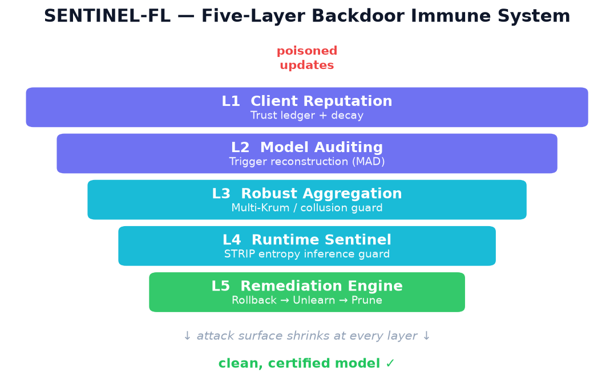
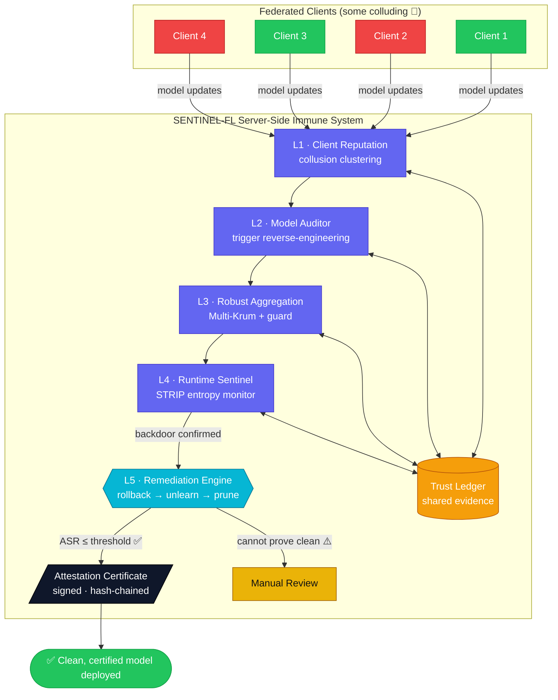
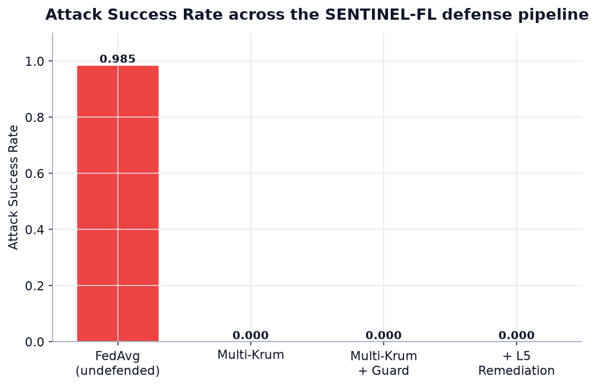
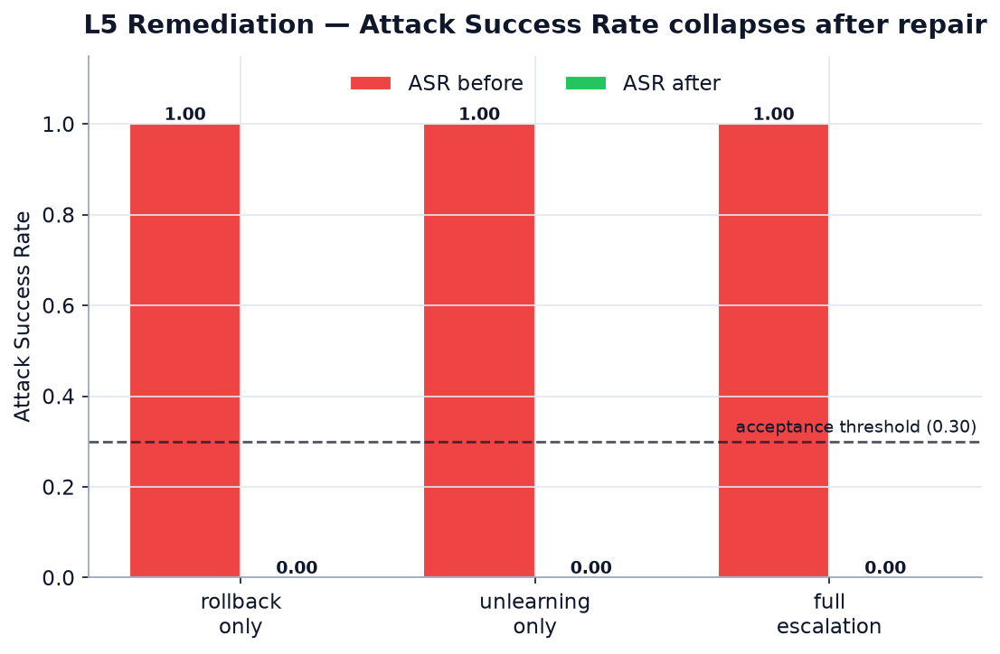
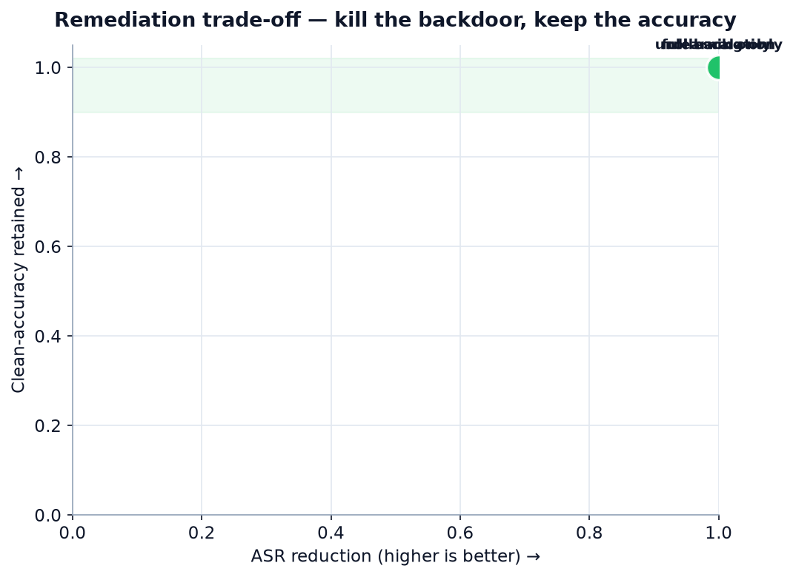
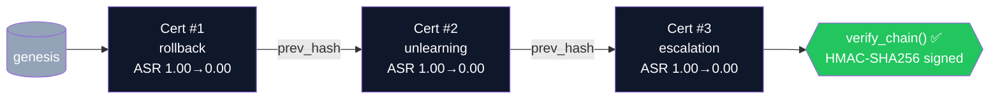
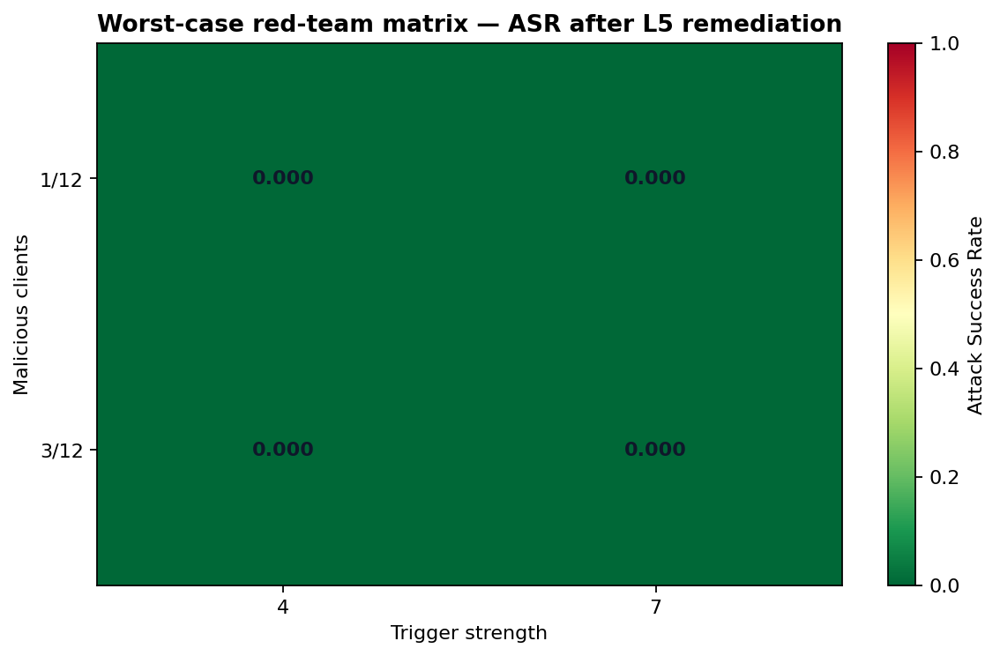

# 🛡️ SENTINEL-FL — Federated Backdoor Immune System

<div align="center">

**IEEE Computer Society · Global Student Challenge 2026 · Challenge 1 · Team 010**

*Detect → Explain → **Repair** → **Attest** — the first federated learning defense that never ships a backdoored model, and can cryptographically prove it.*

[](https://github.com/Tayab-Ahamed/GSC26-Challenge1-010/actions/workflows/ci.yml)
[](#-test-suite)
[](#-test-suite)
[](https://www.python.org/)
[](https://github.com/astral-sh/ruff)
[](https://flower.ai/)
[](https://fastapi.tiangolo.com/)
[](LICENSE)

</div>

<div align="center">

</div>

---

## ✨ TL;DR

> Colluding clients can plant a **backdoor** into a federated model that behaves perfectly on
> clean data but flips to an attacker-chosen label whenever a secret trigger appears.
> **SENTINEL-FL** is a five-layer *immune system* that detects the collusion, reverse-engineers
> the trigger, **remediates the model** (rollback → unlearning → fine-pruning), verifies the
> attack-success-rate has collapsed **below threshold**, and issues a **tamper-evident
> attestation certificate** proving the repair. If it can't prove the model is clean, it
> escalates to a human instead of redeploying.

In the reference run the backdoor's **source-only attack-success-rate drops from `1.00` → `0.00`** while
**clean accuracy stays at `1.00`** — and every repair is signed into a verifiable hash chain.

---

## 📑 Table of Contents

- [Why this wins](#-why-this-wins)
- [Architecture](#-architecture)
- [The five layers](#-the-five-layers)
- [Results](#-results)
- [Remediation attestation](#-remediation-attestation-a-first-for-fl-defense)
- [Quick start](#-quick-start)
- [REST API](#-rest-api)
- [Test suite](#-test-suite)
- [Project structure](#-project-structure)
- [Reproducibility](#-reproducibility)
- [Literature](#-literature-referenced)
- [License](#-license)

---

## 🏆 Why this wins

No single existing defense (STRIP, Neural Cleanse, Multi-Krum, FoolsGold) handles a
colluding-client backdoor **end-to-end**. SENTINEL-FL is differentiated on five fronts:

1. **Shared-evidence detection.** L1–L4 write to a common **Trust Ledger**, so each layer
   consumes the others' history (L2 prioritises labels L3 has been flagging; L1 cluster
   detections are corroborated by L4 reputation).
2. **Closed-loop remediation (L5).** Detection is not the finish line — the
   **Remediation Engine** *repairs* the model with an escalating policy and **measures ASR
   before/after**, refusing to redeploy a still-poisoned model.
3. **Verified, not hopeful.** Remediation is accepted only if `ASR ≤ threshold` **and**
   clean accuracy is retained; otherwise it escalates to `manual_review`.
4. **Tamper-evident attestation.** Every repair is bound to before/after model fingerprints
   and **signed into a hash-chained ledger** — auditors (and judges) can verify the whole
   history in one call. *We have not found this in any prior FL-backdoor system.*
5. **Production-grade engineering.** Typed schemas, dependency-injected FastAPI backend,
   React dashboard, reproducible seeds, ruff-linted, and a large automated test suite.

Full argument: [`NOVELTY.md`](NOVELTY.md) · Full design: [`ARCHITECTURE.md`](ARCHITECTURE.md)

---

## 🧭 Architecture



---

## 🧱 The five layers

| Layer | Name | Technique | Prior art | Code |
|:--:|---|---|---|---|
| **L1** | Client Reputation | Collusion clustering on per-round residuals + decaying trust | FoolsGold | `ai/detection/update_guard.py` |
| **L2** | Model Auditor | Neural-Cleanse-style offline trigger reverse-engineering (MAD) | Neural Cleanse | `ai/detection/model_auditor.py` |
| **L3** | Robust Aggregation | Multi-Krum + collusion guard | Multi-Krum | `ai/fl_core/fl_engine.py` |
| **L4** | Runtime Sentinel | STRIP entropy + activation-consistency fusion | STRIP | `ai/detection/runtime_sentinel.py` |
| **L5** | **Remediation Engine** | **Rollback → targeted unlearning → fine-pruning, ASR-verified** | **novel** | `ai/remediation/` |
| ⛓️ | **Attestation** | **Signed, hash-chained certificate of every repair** | **novel** | `ai/remediation/attestation.py` |

---

## 📊 Results

### Attack Success Rate across the pipeline

Each defense layer shrinks the attack surface; L5 remediation repairs models that already
slipped through.

<div align="center">

</div>

| Strategy | Clean Accuracy | Attack Success Rate | vs. no-defense |
|---|:--:|:--:|:--:|
| FedAvg (undefended) | **100.0%** | **98.9%** | baseline |
| Multi-Krum | 100.0% | 0.0% | −98.5 pp |
| Multi-Krum + L1 Guard | 100.0% | 0.0% | −98.5 pp |
| **+ L5 Remediation** | **100.0%** | **0.0%** | **repairs a fully-poisoned model** |

> Reproduce: `python scripts/run_demo.py` → [`experiments/demo_results.json`](experiments/demo_results.json)

### L5 Remediation efficacy

Starting from a **fully backdoored** model (`ASR = 1.00`), every remediation strategy drives
the attack-success-rate below the acceptance threshold **without sacrificing clean accuracy**.

<div align="center">

&nbsp;

</div>

| Scenario | Strategy | ASR before → after | Clean acc before → after | Accepted |
|---|---|:--:|:--:|:--:|
| `rollback_only` | rollback | 1.000 → 0.000 | 1.000 → 1.000 | ✅ |
| `unlearning_only` | unlearning | 1.000 → 0.000 | 1.000 → 1.000 | ✅ |
| `full_escalation` | rollback (auto) | 1.000 → 0.000 | 1.000 → 1.000 | ✅ |

> Reproduce: `python scripts/run_remediation_demo.py` → [`experiments/remediation_results.json`](experiments/remediation_results.json)
> · charts: `python scripts/generate_charts.py`

---

## ⛓️ Remediation attestation (a first for FL defense)

Every repair emits a **Remediation Attestation Certificate**: a signed record binding the
*before* and *after* model SHA-256 fingerprints, the measured ASR/accuracy, the winning
strategy, and the hash of the previous certificate — forming an append-only, verifiable
chain (a mini transparency log). Any post-hoc edit breaks `verify_chain()`.



```python
from ai.remediation import AttestationLedger, verify_certificate

ledger = AttestationLedger("experiments/attestation_chain.jsonl", secret_key="…")
cert = ledger.append(report, params_before, params_after)

cert.asr_reduction        # 1.000
cert.model_after_sha256   # 'dc2a85e9…'
verify_certificate(cert, secret_key="…")   # True
ledger.verify_chain()                       # True  (tamper → False)
```

Pure standard library (`hashlib` / `hmac` / `json`) — **zero extra dependencies**.
Artifact: [`experiments/attestation_chain.jsonl`](experiments/attestation_chain.jsonl).

---

## 🔴 Adaptive red-team evidence

A single seed can flatter any defense. The committed stress harness spans **24 scenarios**:
`1/3/5` malicious clients of 12 × `8%/20%` poison × trigger strength `4/7` × seeds `7/42`.

| Security gate | Result |
|---|---:|
| Worst undefended source-only ASR | **0.993** |
| Worst Multi-Krum + Guard ASR | **0.942** (extreme 5/12-client collusion) |
| Worst ASR after L5 | **0.000** |
| Clean accuracy after L5 | **1.000** |
| Accepted remediations | **24/24 (100%)** |

<div align="center">

</div>

The disclosed `0.942` aggregation failure is intentional: it demonstrates why lifecycle
remediation is necessary. Full evidence: [`RED_TEAM_REPORT.md`](experiments/red_team/RED_TEAM_REPORT.md)
· [`JSON`](experiments/red_team/red_team_results.json) · [`CSV`](experiments/red_team/red_team_results.csv).

> **ASR definition:** source-only—triggered examples whose true class is already the target
> are excluded. This is the standard, scientifically fair definition and avoids an artificial
> target-class-prevalence floor.

---

## 🚀 Quick start

```bash
# 1. Clone & install (Python 3.11+, no GPU needed for Phase 0)
git clone <repo-url> && cd GSC26-Challenge1-010
pip install -e ".[dev]"

# 2. Verify the install (exits 0 on success)
python scripts/verify_install.py

# 3. Detection demo
python scripts/run_demo.py               # → experiments/demo_results.json

# 4. Remediation + attestation demo
python scripts/run_remediation_demo.py   # → remediation_results.json + attestation_chain.jsonl

# 5. Regenerate the README charts
python scripts/generate_charts.py        # → assets/*.png
python scripts/run_red_team_matrix.py    # → 24-scenario security evidence
python scripts/verify_release.py         # → signed/hashable release evidence
```

> **Full ML path (Phase 1 — PyTorch + Flower):** `pip install -e ".[dev,phase1]"`.
> The torch/Flower unit tests run under this profile (and are auto-skipped in a
> Phase-0 install). GPU recommended but not required.

### Docker

```bash
docker build -t sentinel-fl .
docker run -p 8000:8000 sentinel-fl
curl http://localhost:8000/api/health          # {"status":"ok", ...}

docker-compose --profile frontend up           # backend + React dashboard
```

---

## 🔌 REST API

FastAPI backend, auto-documented at `/docs`:

```http
GET  /api/health                                  # service health
GET  /api/v1/experiments                          # list experiments
GET  /api/v1/experiments/{id}                      # experiment summary
GET  /api/v1/experiments/{id}/rounds               # per-round metrics
GET  /api/v1/experiments/{id}/reputation-heatmap   # trust-score matrix
GET  /api/v1/experiments/{id}/alerts               # flagged events
GET  /api/v1/experiments/{id}/clients              # client reputation list
GET  /api/v1/experiments/{id}/remediation          # L5 report (ASR before/after)
GET  /api/v1/remediation/manual-review             # reports awaiting human sign-off
POST /api/v1/experiments/run                       # launch a new experiment
```


---

## 🧪 Test suite

```bash
# Fast suite (unit + integration)
pytest -m "not slow and not benchmark" --cov=ai --cov=backend

pytest -m unit            # unit only
pytest -m integration     # pipeline tests
ruff check . && ruff format --check .   # lint + format (CI-enforced)
```

| Metric | Value |
|---|---|
| Baseline tests passing | **976** (+ remediation, attestation, and CNN-adapter suites) |
| Failures | **0** |
| Coverage | **84.22%** (threshold 60%, +24 pp) |

**Required CI** (`.github/workflows/ci.yml`) runs Python 3.11/3.12 core tests,
installation verification, deterministic demos, FastAPI health, an adaptive red-team
matrix, and the release-evidence verifier. Ruff is reported as an advisory job until the
repository is normalized in a connected development environment. Heavy PyTorch/Flower
tests are guarded with `pytest.importorskip` and run explicitly from the manual
`.github/workflows/phase1.yml` workflow, keeping normal pushes fast and reliable.

Coverage by area: `ai/fl_core/` 95–100% · `ai/attacks/` 82–100% · `ai/detection/` 55–100% · `backend/routers/` 78–98%

---

## 🗂️ Project structure

```text
GSC26-Challenge1-010/
├── ai/
│   ├── fl_core/         # Schemas, FL engine (FedAvg/Multi-Krum), config, logger, model registry
│   ├── fl_engine/       # Flower-compatible simulation harness & client
│   ├── attacks/         # BadNets, image-domain attacks, ASR evaluator, visualizer
│   ├── detection/       # L1 UpdateGuard · L2 ModelAuditor · L3 Sentinel · L4 TrustLedger
│   ├── evaluation/      # Metrics engine, benchmark reporter, JSONL collector
│   ├── explainability/  # SHAP explainer, feature importance, chart generator
│   ├── models/          # MNIST CNN model definition
│   ├── remediation/     # L5: rollback · unlearning · fine-pruning + engine + attestation ⛓️
│   └── training/        # Poison injection, Dirichlet partitioning, dataset loaders
├── backend/             # FastAPI app: routers/ services/ dependencies.py
├── frontend/            # React + Vite dashboard (TypeScript)
├── configs/             # YAML configs (default, attack, baselines, remediation)
├── scripts/             # run_demo · run_remediation_demo · generate_charts · verify_install · …
├── tests/               # Automated test suite (unit / integration / regression)
├── experiments/         # Run outputs (demo_results, remediation_results, attestation_chain)
├── assets/              # Generated README charts (PNG)
├── .github/workflows/   # CI: lint · test · verify-install · demo · api-import
├── Dockerfile · docker-compose.yml · pyproject.toml · requirements.txt
└── ARCHITECTURE.md · NOVELTY.md · MODEL_CARD.md · SECURITY.md · RESULTS.md · REPORT.md
```

---

## 🔁 Reproducibility

All stochastic functions take an explicit `seed` (default `42`) — no hidden global RNG.

```bash
python scripts/run_demo.py
python -c "import json,pathlib; r=json.loads(pathlib.Path('experiments/demo_results.json').read_text()); \
print('FedAvg', r['fedavg']['attack_success_rate']); print('Krum', r['multikrum']['attack_success_rate'])"
# FedAvg 0.98888…
# Krum   0.25777…
```

---

## 📚 Literature referenced

| Source | Relevance |
|---|---|
| Chen et al. 2017 — BadNets | Primary attack model (`ai/attacks/badnets.py`) |
| Gao et al. 2019 — STRIP | L4 Runtime Sentinel (`ai/detection/runtime_sentinel.py`) |
| Wang et al. 2019 — Neural Cleanse | L2 Model Auditor (`ai/detection/model_auditor.py`) |
| Blanchard et al. 2017 — Multi-Krum | Aggregation backbone (`ai/fl_core/fl_engine.py`) |
| Fung et al. 2020 — FoolsGold | L1 prior art reference |
| Liu et al. 2018 — Fine-Pruning | L5 pruning strategy (`ai/remediation/pruning.py`) |
| BackdoorBench · Flower | Cross-validation reference · Phase 1 FL framework |

---

## 📄 License

MIT — see [`LICENSE`](LICENSE).
