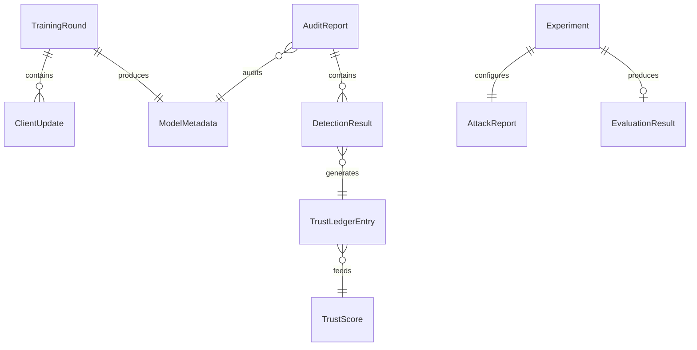

# SCHEMAS.md — Data Models

All objects are JSON-serializable (used in Logger payloads, API responses, and the
Trust Ledger). Types use Python-style annotations; production implementation should
back these with `pydantic` models (see `TECH_STACK.md`) for automatic validation.

---

## ClientUpdate

Produced by a client each FL round, consumed by L1 (Aggregator, Update Guard).

| Field | Type | Validation | Notes |
|---|---|---|---|
| `client_id` | str | required, matches a registered client | |
| `round_num` | int | >= 0 | |
| `delta` | float[] | required, length == model param count | flattened model delta |
| `n_samples` | int | > 0 | local dataset size, used for weighting |
| `timestamp` | ISO8601 str | required | |
| `signature` | str \| null | optional | reserved for Security Layer (§ below), not required in Phase 0 |

```json
{
  "client_id": "client_07",
  "round_num": 12,
  "delta": [0.0021, -0.0004, ...],
  "n_samples": 480,
  "timestamp": "2026-07-20T14:03:11Z",
  "signature": null
}
```

## ModelMetadata

Attached to every checkpoint in the Model Registry.

| Field | Type | Notes |
|---|---|---|
| `model_id` | str | UUID |
| `round_num` | int | |
| `architecture` | str | e.g. "linear_softmax_v0", "resnet18_cifar" |
| `parent_model_id` | str \| null | for rollback lineage |
| `clean_accuracy` | float \| null | filled by Evaluation pipeline once measured |
| `created_at` | ISO8601 str | |

## AttackReport

Produced by an `AttackSimulator` run during evaluation (ground truth, never seen by
the defense pipeline during training — only used to score detectors after the fact).

| Field | Type | Notes |
|---|---|---|
| `attack_id` | str | |
| `attack_type` | str | e.g. "badnet_colluding" |
| `malicious_client_ids` | str[] | ground truth |
| `target_class` | int | |
| `poison_fraction` | float | 0–1 |
| `rounds_active` | int[] | which rounds the attack was injected |

## DetectionResult

Returned by a `Detector.score(...)` call (L2 or L3).

| Field | Type | Notes |
|---|---|---|
| `detector_name` | str | e.g. "strip_entropy" |
| `layer` | "L2" \| "L3" | |
| `subject_id` | str | input id (L3) or label id (L2) |
| `score` | float | raw detector score (e.g. entropy value, L1 norm) |
| `flagged` | bool | score compared against calibrated boundary |
| `boundary` | float | the calibration threshold used |
| `round_num` | int \| null | null for L3 (per-inference, not per-round) |

## TrustScore

L4's per-client and per-label running score.

| Field | Type | Notes |
|---|---|---|
| `subject_type` | "client" \| "label" | |
| `subject_id` | str | |
| `score` | float | 0 (fully trusted) – 1 (fully flagged), decayed over rounds |
| `last_updated_round` | int | |
| `contributing_events` | str[] | list of `TrustLedgerEntry.entry_id` that fed this score |

## TrainingRound

One row per FL round, the backbone of the dashboard timeline.

| Field | Type | Notes |
|---|---|---|
| `round_num` | int | |
| `participating_clients` | str[] | |
| `excluded_clients` | str[] | excluded by L1 aggregator (e.g. Multi-Krum) |
| `flagged_clusters` | str[][] | L1 collusion clusters, list of client-id groups |
| `global_model_id` | str | resulting `ModelMetadata.model_id` |
| `clean_accuracy` | float \| null | if evaluated this round |
| `attack_success_rate` | float \| null | if evaluated this round |

## AuditReport

Produced by L2 (Model Auditor) every N rounds.

| Field | Type | Notes |
|---|---|---|
| `audit_id` | str | |
| `round_num` | int | which global model was audited |
| `per_label_results` | DetectionResult[] | one per audited label |
| `flagged_labels` | int[] | labels exceeding the anomaly threshold |
| `reversed_triggers` | object[] | `{label, trigger_representation}` for flagged labels |

## EvaluationResult

Output of `MetricsCollector.compute(...)` (see `INTERFACES.md`), the standard metric
set defined in `BENCHMARK.md`.

| Field | Type | Notes |
|---|---|---|
| `experiment_id` | str | |
| `clean_accuracy` | float | |
| `attack_success_rate` | float | |
| `robust_accuracy` | float | |
| `false_acceptance_rate` | float | L3, on held-out trojaned set |
| `false_rejection_rate` | float | L3, on held-out clean set |
| `detection_latency_ms` | float | L3, per-input |
| `communication_cost_bytes` | int | total bytes transferred across all rounds |

## Experiment

Top-level object tying a config + dataset + attack + defense combination together for
the ablation study (`BENCHMARK.md`).

| Field | Type | Notes |
|---|---|---|
| `experiment_id` | str | |
| `config_ref` | str | path under `configs/` |
| `dataset_phase` | "phase0_synthetic" \| "phase1_official" | |
| `layers_enabled` | str[] | subset of ["L1","L2","L3"] — L4 always on (it's passive logging) |
| `attack_config` | AttackReport | |
| `result` | EvaluationResult \| null | filled once the experiment completes |

## Configuration

Root object for `configs/*.yaml` files.

| Field | Type | Notes |
|---|---|---|
| `n_clients` | int | |
| `n_rounds` | int | |
| `aggregator` | str | registered `Aggregator` name |
| `detectors` | str[] | registered `Detector` names to activate |
| `krum_f` | int | assumed malicious count for Multi-Krum |
| `collusion_sim_threshold` | float | 0–1, L1 clustering threshold |
| `collusion_min_cluster_size` | int | |
| `strip_n_perturb` | int | |
| `strip_target_frr` | float | |
| `audit_interval_rounds` | int | how often L2 runs |

## Metric

Generic single time-series point, used internally by the dashboard's
`metric_timeseries` endpoint (`API.md`).

| Field | Type |
|---|---|
| `metric_name` | str |
| `round_num` | int |
| `value` | float |

## LogEntry

The universal structured log line every layer emits (`Logger` interface,
`ARCHITECTURE.md` §6).

| Field | Type | Notes |
|---|---|---|
| `timestamp` | ISO8601 str | |
| `layer_id` | "L1"\|"L2"\|"L3"\|"L4" | |
| `event_type` | str | e.g. "client_excluded", "cluster_flagged", "input_flagged" |
| `round_num` | int \| null | |
| `payload` | object | event-specific, cross-referenced against the schema above matching `event_type` |

## TrustLedgerEntry

The record L4 actually stores per flag (referenced by `TrustScore.contributing_events`).

| Field | Type | Notes |
|---|---|---|
| `entry_id` | str | |
| `layer_id` | str | which layer produced this |
| `subject_type` | "client" \| "label" \| "input" | |
| `subject_id` | str | |
| `round_num` | int \| null | |
| `score` | float | |
| `reason` | str | human-readable, from `Detector.explain(...)` |
| `evidence` | object | raw feature vector / similarity matrix slice / reversed trigger, for drill-down |

---

## Relationships


